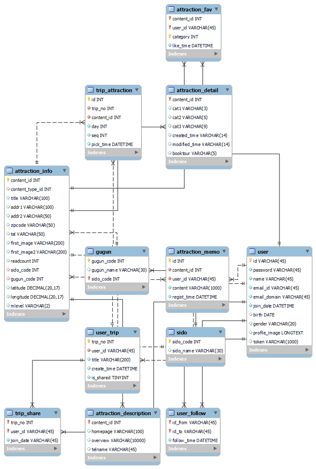
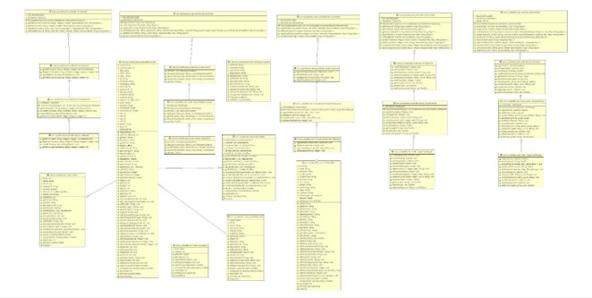
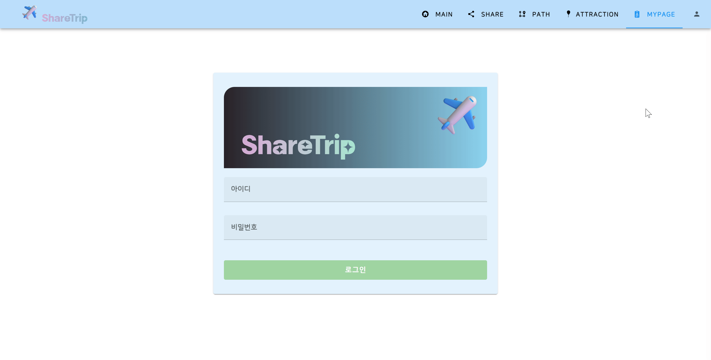
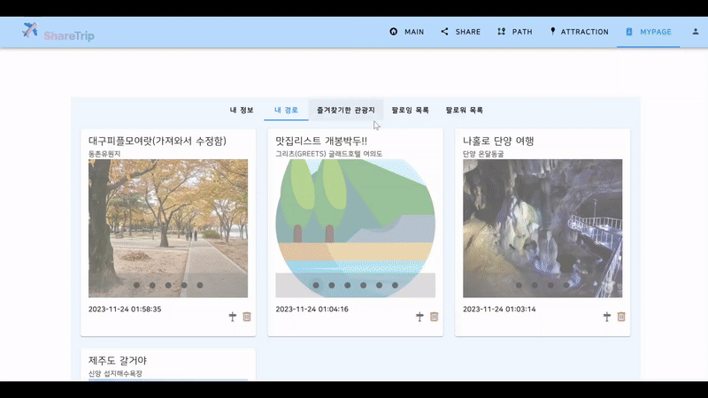
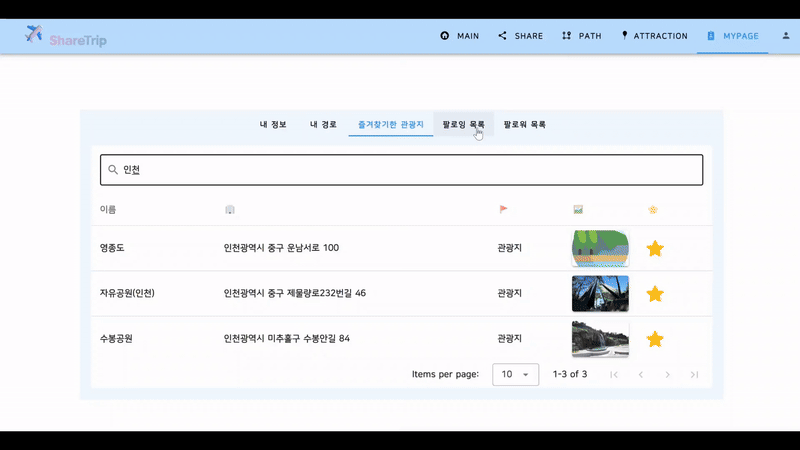

   
  
   
  <h1> 쉐어 트립 (ShareTrip)</h1>
  <h3>🛫 관광지 여행 경로 생성 및 공유 서비스</h3>
  

## 목차

1. [**웹 서비스 소개**](#1)
1. [**버전 기록**](#2)
1. [**기술 스택**](#3)
1. [**주요 기능**](#4)
1. [**프로젝트 구성도**](#5)
1. [**서비스 화면**](#6)
1. [**개발 팀 소개**](#7)
1. [**개발 기간**](#8)

 

## 💁 웹 서비스 소개

**쉐어트립(ShareTrip)** 은 여러명이서 함께 여행경로를 공유할 수 있는 여행 서비스입니다.

쉐어트립은 시도/ 구군/ 여행 컨텐츠/ 키워드에 따라 관광지를 검색할 수 있으며 지도 상에서 바로바로 관광지를 확인할 수 있습니다.

특정 관광지를 선택하여 경로를 짠 뒤 맞팔한 사람들과 함께 경로를 공유할 수 있으며, 원하는 경우 공개적으로 다른 사람들과 함께 경로를 공유할 수 있습니다.

여행 경로 게시판은 공개 경로/ 그룹 경로로 나뉘어져 있어 선택에 따라 다른 사람의 여행 경로를 조회하거나 같은 그룹이 만든 경로를 확인할 수 있습니다.

관광지 참조, 좋아요, 북마크 등 여러 기준에 따라 인기있는 관광지 통계를 확인할 수 있습니다.

 

[**🔗 웹 서비스로 바로가기**](https://ssafymate.site) (서비스 종료)

 

## 👷 버전 기록

|   버전   | 
업데이트 내용
 | 업데이트 날짜 |
| :------: | :-------------------------------------- | :-----------: |
| `v1.1.0` | - 쉐어트립 서비스 오픈                  |   23.12.24.   |

 

## 🛠 기술 스택

### **Front-end**

|  |  |  |
| :------------------------------------------------------------------------------------------------------------------------------: | :----------------------------------------------------------------------------------------------------------------------------: | :-------------------------------------------------------------------------------------------------------------------------------: |
|                                                              HTML5                                                               |                                                              CSS3                                                              |                                                            JavaScript                                                             |

|  |  |
| :-----------------------------------------------------------------------------------------------------------------------: | :------------------------------------------------------------------------------------------------------------------------------: |
|                                                         Vuetify3                                                          |                                                              Vuejs                                                               |

### **Back-end**

|  |  |  |
| :----------------------------------------------------------------------------------------------------------------------------: | :-----------------------------------------------------------------------------------------------------------------------------------------------: | :------------------------------------------------------------------------------------------------------------------------------: |
|                                                              Java                                                              |                                                                    Spring-Boot                                                                    |                                                              MySQL                                                               |

### **DevOps**

|  |  |
| :-----------------------------------------------------------------------------------------------------------------: | :--------------------------------------------------------------------------------------------------------------------------------: |
|                                                         Git                                                         |                                                                aws                                                                 |

 

## 💡 주요 기능

  <table >
    <tr>
      <th width="150">기능</th>
      <th>내용</th>
    </tr>
    <tr>
      <td>관광지 조회 </td>
      <td>시도/ 구군/ 여행 컨텐츠/ 키워드로 검색한 관광지를 지도 상에서 조회할 수 있습니다.</td>
    </tr>
    <tr>
      <td>관광지 상세 조회</td>
      <td>특정 관광지의 정보를 조회하거나 좋아요, 북마크를 클릭하여 댓글을 작성할 수 있습니다.</td>
    </tr>
     <tr>
      <td>여행 경로 공유</td>
      <td>특정 관광지들을 따로 저장하여 나만의 경로를 생성 및 공유할 수 있습니다. 또한 서로 맞팔한 사람을 초대하여 그룹 단위로 여행 경로를 공유할 수 있습니다. </td>
    </tr>
     <tr>
      <td>여행 전체 표시</td>
      <td>여행 경로를 저장할 때 공유버튼을 클릭하면 여행 경로 게시판에서 내가 만든 여행경로를 다른 사람들과 공유할 수 있습니다.</td>
    </tr>
     <tr>
      <td> 여행 경로 게시판(공개 경로)</td>
      <td> 공개 경로에서 다른 사람들이 공유한 여행경로를 확인할 수 있습니다.   </td>
    </tr>
     <tr>
      <td>여행 경로 게시판(그룹 경로)</td>
      <td>그룹 경로에서 그룹끼리 만든 여행경로를 확인할 수 있습니다.</td>
    </tr>
     <tr>
      <td> 관광지 통계 </td>
      <td>관광지 참조, 좋아요, 북마크, 경로 포함, 성별, 연령대별로 통계를 확인하여 인기있는 관광지 1,2,3등 확인할 수 있습니다.   </td>
    </tr>
  </table>

 

## 📂 프로젝트 구성도

|                              개체-관계 모델(ERD)                              |                                  클래스 다이어그램                                   |
| :---------------------------------------------------------------------------: | :----------------------------------------------------------------------------------: |
|  |  |

 

 

## 🖥️ 서비스 화면

  <h3>회원가입</h3>
  

  <h3>검색</h3>
 

  <h3>지도 위치기반 관광지조회</h3>
 

  <h3>관광지 상세조회</h3>
 

  <h3>경로 생성</h3>
 

  <h3>그룹경로 조회 및 그룹원 추가</h3>
 

  <h3>경로 가져오기 및 타이틀 수정</h3>
 

  <h3>마이페이지 경로 조회 및 삭제</h3>
 

  <h3>즐겨찾기한 관광지조회</h3>
 

  <h3>팔로우</h3>
 

 

 

## 👪 개발 팀 소개

<table align="center">
  <tr>
    <td align="center" width="150px">
      
    </td>
    <td align="center" width="150px">
      
    </td>
    <td align="center" width="150px">
      
    </td>
  </tr>
  <tr>
    <td align="center">
      <a href="https://github.com/ChaNyeok1225" target="_blank">
        전찬혁 
      </a>
    </td>
    <td align="center">
      <a href="https://github.com/Ryujy" target="_blank">
        류지윤 
      </a>
    </td>
    <td align="center">
      <a href="https://github.com/eunalove" target="_blank">
        오은아 
      </a>
    </td>
  </tr>
</table>

 

 

## 📅 개발 기간

23.11.16. ~ 23.11.24

 

 

